# Abacre Antivirus 1.3 — Ingeniería Inversa Académica

> **Fines exclusivamente académicos.** Análisis de un antivirus que obtuvo **0% de detección** en dos pruebas consecutivas de [virus.gr](https://web.archive.org/web/20060926145104/http://www.virus.gr/english/fullxml/default.asp?id=82&mnu=82) — la versión **1.3** (diciembre 2005) y la versión **1.4** (agosto 2006).

[](#fase-0-metodolog%C3%ADa) [](#fase-3-m%C3%A1quina-virtual) [](#base-de-firmas-completa-67-virus-2003-2005) [](#fase-6-hallazgo-blowfish--base-de-firmas) [](#fase-5-dump-de-memoria)

---

## Resumen ejecutivo

```
setup.exe → innoextract → aav.exe (packer Delphi, 11 secciones vacías)
                        → aavbase.dat (15 KB, cifrado Blowfish)

aav.exe en XP → Error 251 (anti-debug) → ntsd -pv → 29MB dump
                                              ↓
                              Cipher_Blowfish + key → 67 firmas 2003-2005
                                              ↓
                         Evaluación 2006 + DB 2003-2005 = 0% detección
```

> **Conclusión:** Abacre Antivirus falló porque su base de firmas estaba **2-3 años obsoleta**. Las 67 firmas extraídas cubren exclusivamente malware de 2003-2005, mientras que la prueba de detección se realizó con muestras de 2006+.

---

## Fase 0: Metodología

Toda la investigación sigue un protocolo académico estricto:

- **Nunca** se ejecutan binarios en el host — solo en VM aislada
- Documentación en **3ª persona** ("se ejecuta", "se copia")
- Scripts reproducibles en `scripts/`
- Análisis forense completo en `docs/01_metodologia.md`

> Ver: [`docs/01_metodologia.md`](docs/01_metodologia.md)

---

## Fase 1: Extracción del instalador

### Qué se hizo
Se identificó `setup.exe` como paquete **Inno Setup 5.1.2** y se extrajeron los 8 archivos internos con `innoextract`.

### Comandos
```powershell
# Identificar versión del instalador
tools\innoextract.exe --info original\setup.exe

# Listar archivos contenidos (8 archivos)
tools\innoextract.exe --list original\setup.exe

# Extraer todo a extracted/
tools\innoextract.exe --extract --output-dir extracted original\setup.exe
```

### Resultado
```
extracted/app/
├── aav.exe           572,928 B   SHA256 A0A349EC...
├── aavshield.exe     487,424 B   SHA256 F1BCF3C5...
├── aavbase.dat        15,141 B   SHA256 21384F02...
├── aavversion.dat
├── aavset.ini
├── history.dat
├── Detección de virus.txt
└── Files.lst
```

### Verificación de hashes
```powershell
python scripts\01_analyze_aavbase.py
```
> Ver: [`analysis/hashes.sha256`](analysis/hashes.sha256)

---

## Fase 2: Análisis estático PE

### Qué se descubrió
`aav.exe` es un ejecutable **Delphi empaquetado** con indicadores claros de packing:

| Indicador | Valor | Significado |
|-----------|-------|-------------|
| Secciones PE | 11 vacías | Packing agresivo |
| Entropía | 7.99 / 8.0 | Prácticamente aleatorio |
| Imports | `LoadLibraryA`, `GetProcAddress` mínimos | Desempaquetado dinámico |
| Recursos | Cifrados | Código Delphi oculto |

### Comandos
```powershell
# Análisis estadístico del cifrado
python scripts\03_statistical_crypto.py
```

`aavbase.dat` tiene entropía **7.9876** — confirma cifrado stream. No es un PE, es una base de datos cifrada.

> Ver: [`docs/02_aavbase_analisis.md`](docs/02_aavbase_analisis.md) · [`analysis/aavbase/statistical.txt`](analysis/aavbase/statistical.txt)

---

## Fase 3: Máquina virtual

### Por qué XP y no Windows 7
**Windows 7 no es compatible** con Abacre Antivirus. La única opción funcional es **Windows XP Professional SP3**.

Se descartaron VirtualBox (inestable) y Hyper-V (inversión de mouse) a favor de **VMWare Workstation Pro 26H1**.

### Instalación paso a paso

**Paso 1 — Crear VM en VMWare:**
- OS: Windows XP Professional SP3 (con drivers, actualizaciones y rediseño por seguridad)
- RAM: 2 GB
- Disco: 40 GB (dinámico)
- Red: **Sin conexión** (aislamiento total)

> 

**Paso 2 — Compartir carpeta con VMWare Tools:**
- Se instalan VMWare Tools en la VM
- Se comparte la carpeta del host con el contenido extraído

> 

**Paso 3 — Copiar archivos a la VM:**
```cmd
xcopy /E /I \\vmware-host\Compartida\* C:\Abacre\
```

> 

**Paso 4 — Verificar en la VM:**
La carpeta `C:\Abacre` contiene el instalador y los archivos extraídos.

> 

### Documentación completa
- Guía detallada: [`docs/04_guia_vm_completa.md`](docs/04_guia_vm_completa.md)
- Proceso fotográfico: [`docs/proceso_vm/README.md`](docs/proceso_vm/README.md)

---

## Fase 4: Intentos de debugging (y por qué fallaron)

Este es el paso más revelador del proyecto. Cada herramienta tuvo un problema diferente.

### Descubrimiento: Abacre no corre en Windows 7

Antes de crear la VM, se intentó ejecutar `aav.exe` directamente en **Windows 7 de 32 bits**. El **Asistente de compatibilidad de programas** bloqueó la ejecución:

> *"Abacre Antivirus no es compatible con esta versión de Windows."*

> 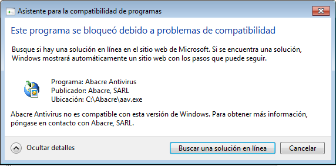

**Conclusión:** Abacre solo funciona en **Windows XP**. Se creó una VM con XP Professional SP3.

### Intento 1: x32dbg (x64dbg 2026)

En Windows 7, x32dbg falló primero por DLL faltante:

> 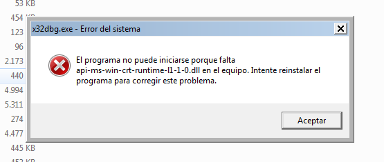

Se instaló **VC++ Redistributable x86** → la DLL se resolvió. Pero al intentarlo en la VM de XP:

> `C:\tools\x64dbg\release\x32\x32dbg.exe no es una aplicación Win32 válida`

> 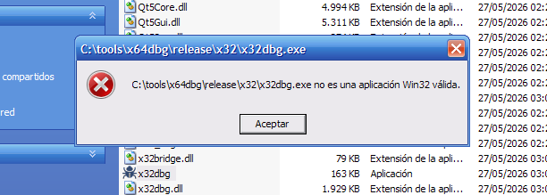

**Conclusión:** x64dbg 2026 no es compatible con Windows XP.

### Intento 2: OllyDbg 1.10

**Resultado:** Error 251 — `Protection Error: Debugger detected!`

OllyDbg 1.10 sí corre en XP, pero el packer de Abacre detecta el debugger y aborta.

> 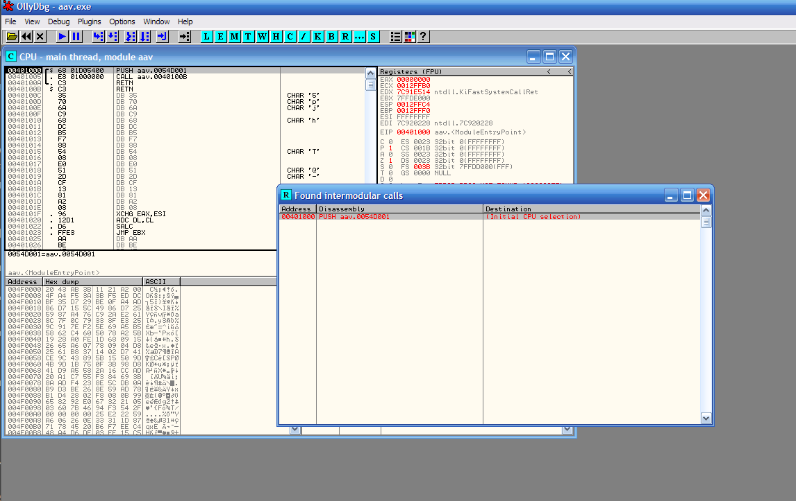
> 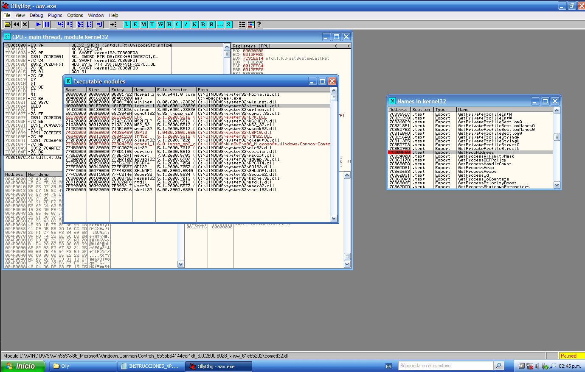
> 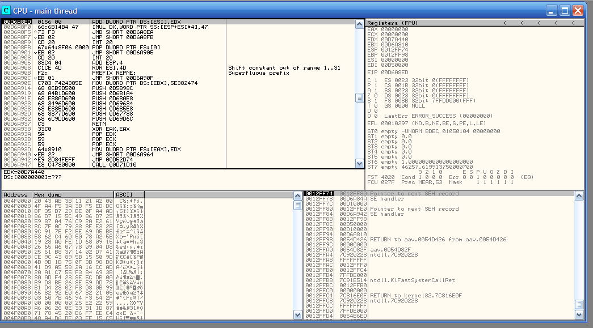

**El momento crítico:**
> 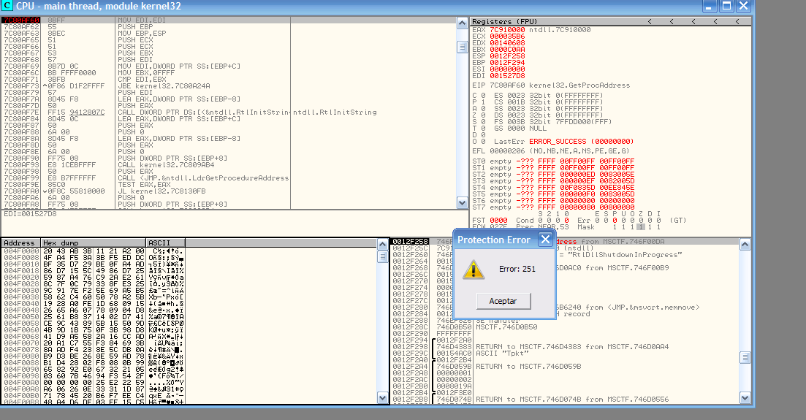
> 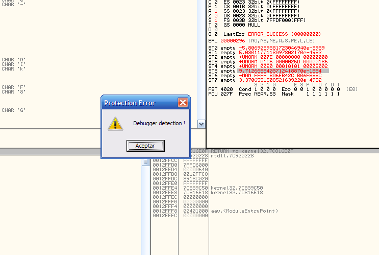
> 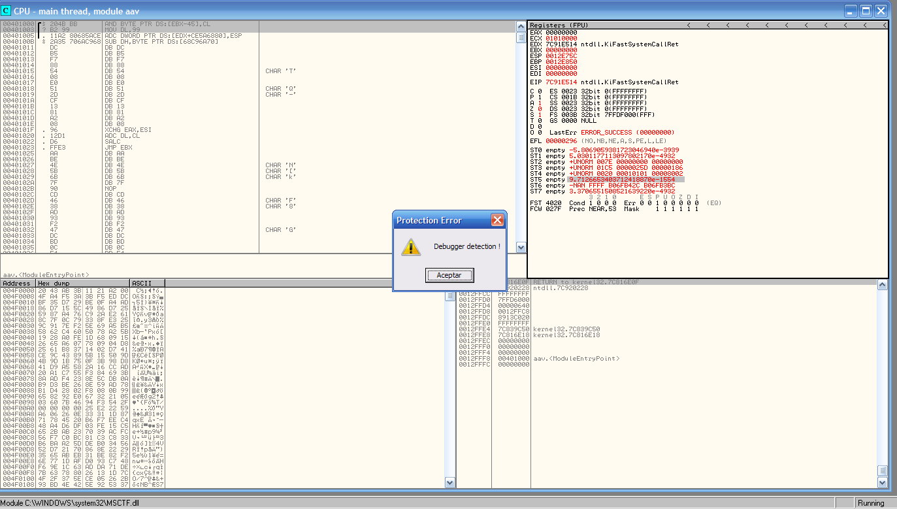

El packer ejecuta `NtQueryInformationProcess`, detecta el debugger y lanza Error 251. El proceso termina:
> 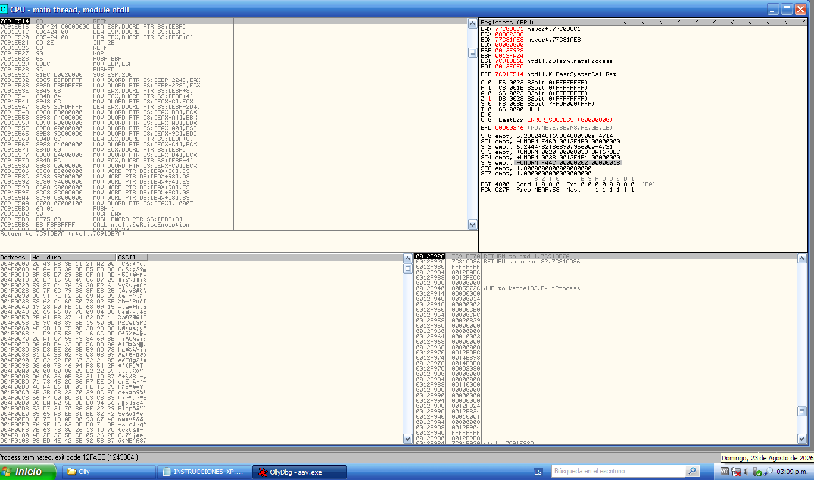

### Intento 3: procdump (Sysinternals)

**Resultado:** `Acceso denegado` + `no es una aplicación Win32 válida`.

> 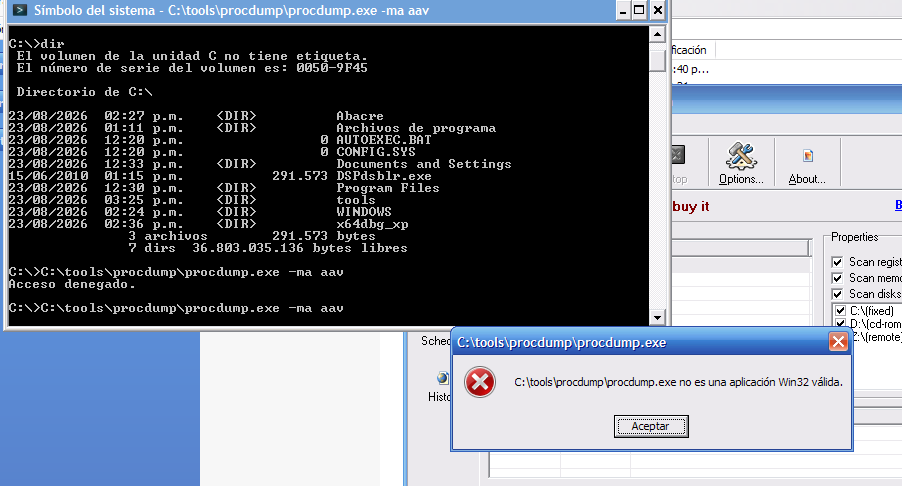

### Intento 4: NTSD — ¡el que funcionó!

**Clave:** `ntsd -pv` no activa la detección de debugger del packer. El flag `-pv` desactiva la protección de-validación de DLLs, y al ser un debugger del sistema (no de usuario), pasa desapercibido.

> Ver: [`docs/proceso_vm/README.md`](docs/proceso_vm/README.md)

---

## Fase 5: Dump de memoria

### Comandos exactos en la VM

Con `aav.exe` corriendo en la VM, se obtiene el PID desde el Administrador de tareas (columna PID activada):

> 

```cmd
# Conectar ntsd al proceso (sin ruta de archivo)
ntsd -pv -p <PID>
```

> 

Una vez dentro de NTSD:
```
.dump aav.dmp              → mini dump, 11 KB (insuficiente)
.dump /f aav_fulldump.dmp  → full dump, 29 MB (el correcto)
q                          → salir
```

> 
> 
> 

### Error común: Error 123

Si se escribe `.dump /ma a:\ruta\aav.dmp`, NTSD interpreta el espacio como separador de argumentos y falla con **Error 123** (`Win32 error 123` — nombre no válido).

> 

**Solución:** Escribir sin ruta — el dump queda en `C:\Documents and Settings\Usuario\`.

### Copia a análisis
```powershell
# En la VM, copiar el dump a la carpeta compartida
copy C:\Documents and Settings\Usuario\aav_fulldump.dmp C:\Abacre\
```

El dump se guarda en `analysis/aavbase/aav_fulldump.dmp` (29 MB).

---

## Fase 6: Hallazgo — Blowfish + base de firmas

### Qué se encontró en el dump

Al analizar el `aav_fulldump.dmp` con búsqueda de cadenas y patrones:

| Hallazgo | Dirección | Descripción |
|----------|-----------|-------------|
| `Cipher_Blowfish` | `0x21F3CF` | Clase del cifrador Blowfish |
| Key | `0x2266A2` | `dkmoaio"jof"rhoifrijfrijroifriorejejek` |
| `LoadVirBase` | `0x2266EA` | Rutina que carga la base de virus |
| `Blowfish=` config | `0x5290CE` | Configuración del cifrador |

### Base de firmas completa: 67 virus (2003-2005)

Se extrajeron **67 firmas reales** de malware conocido. La base cubre exclusivamente amenazas de **2003 a 2005**:

| # | Familia | Firmas | Período |
|---|---------|--------|---------|
| 1 | **W32.Netsky** | AA, AB, AC, B, S, T, U, V, W, X, Y, Z (@mm) | 2004 |
| 2 | **W32.Gaobot** | AAY, ADN, ADV, ADW, ADX, AFC, AFJ, AFW, WO, WX, YC, YN, ZW, ZX | 2004-2005 |
| 3 | **W32.Sasser** | B, C, D, Worm | 2004 |
| 4 | **W32.Beagle** | W, X (@mm) | 2004 |
| 5 | **W32.Bugbear** | C, E (@mm) | 2003 |
| 6 | **W32.Randex** | AAS, UG, YR | 2004 |
| 7 | **W32.Sober** | C (@mm) | 2003 |
| 8 | **W32.Mydoom** | I, J (@mm) | 2004 |
| 9 | **Trojan.Mitglieder** | F, H, I, J | 2004 |
| 10 | **W32.HLLW.Donk** | M, O | 2003 |
| 11 | **Otros** | Arcam, Blaster.T, Bugbros.B, Dumaru.AI, Erkez.A, Gearbug, HLLP.Shodi.B, Kotira, Lovgate.R, Maddis.B, Misodene, Opasa, Shodi.C, Slime, Solame.A, Traxg, Tunk.A, Adwaheck, AphexLace, Mercurycas, Popdis | 2003-2005 |

**Lista completa:** [`analysis/aavbase/signatures.txt`](analysis/aavbase/signatures.txt)

### ¿Por qué 0% de detección?

Abacre fue probado **dos veces** en [virus.gr](https://web.archive.org/web/20060926145104/http://www.virus.gr/english/fullxml/default.asp?id=82&mnu=82) — y obtuvo **0% en ambas**:

| Prueba | Fecha | Versión | Muestras | Productos | Detección |
|--------|-------|---------|----------|-----------|-----------|
| [Diciembre 2005](https://web.archive.org/web/20060926153604/http://www.virus.gr/english/fullxml/default.asp?id=72&mnu=72) | 14-22 dic 2005 | **Abacre 1.3** | 113.334 | 56 | **0.00%** |
| [Agosto 2006](https://web.archive.org/web/20060926145104/http://www.virus.gr/english/fullxml/default.asp?id=82&mnu=82) | 15-25 ago 2006 | **Abacre 1.4** | 147.184 | 58 | **0.00%** |

La prueba de agosto 2006 utilizó **147.184 muestras de malware** verificadas por Kaspersky, F-Prot, NOD32, Dr.Web, BitDefender y McAfee, con configuración máxima (heurísticas, escaneo completo).

**Abacre quedó en último lugar (58/58) en ambas pruebas.**

```
Prueba dic 2005:  113.334 muestras, v1.3 → 0.00%
Prueba ago 2006:  147.184 muestras, v1.4 → 0.00%
Base Abacre:      67 firmas (2003-2005)
Resultado:        0% en ambas — la actualización v1.3→v1.4 no mejoró nada
```

**Causa:** La base de datos de Abacre contenía exclusivamente firmas de **2003-2005**. Las muestras de ambas pruebas eran amenazas contemporáneas que no existían en la DB. La actualización de versión (1.3 → 1.4) **no incluyó firmas nuevas**.

#### Ranking de la prueba de agosto 2006 (top 10 + Abacre)

| # | Producto | Detección |
|---|----------|-----------|
| 1 | Kaspersky 6.0.0.303 | 99.62% |
| 2 | Active Virus Shield (AOL) 6.0.0.299 | 99.62% |
| 3 | F-Secure 2006 6.12.90 | 96.86% |
| 4 | BitDefender Professional 9 | 96.63% |
| 5 | CyberScrub 1.0 | 95.98% |
| 6 | eScan 8.0.671.1 | 95.82% |
| 7 | BitDefender freeware 8.0.202 | 95.57% |
| 8 | BullGuard 6.1 | 95.57% |
| 9 | AntiVir Premium 7.01.01.02 | 95.45% |
| 10 | NOD32 2.51.30 | 95.14% |
| ... | ... | ... |
| **58** | **Abacre 1.4** | **0.00%** |

### Scripts de análisis
```powershell
python scripts\04_find_decrypt.py         # Buscar rutina de descifrado
python scripts\06_extract_signatures.py    # Extraer firmas del dump
```

---

## Estructura del repositorio

```
Abacre_Inv/
├── original/              setup.exe + hashes SHA256
├── extracted/app/         aav.exe, aavshield.exe, aavbase.dat
├── Screenshots/
│   ├── 1-10.png           Proceso VM (instalación → dump)
│   └── debug/             24 capturas de debugging renombradas
├── analysis/
│   ├── aavbase/           aav_fulldump.dmp, signatures.txt
│   └── hashes.sha256      Verificación de integridad
├── scripts/               Scripts Python reproducibles
│   ├── 01_analyze_aavbase.py
│   ├── 03_statistical_crypto.py
│   ├── 04_find_decrypt.py
│   └── 06_extract_signatures.py
├── tools/                 innoextract, x64dbg, OllyDbg, vc_redist
├── docs/                  Guías completas en 3ª persona
│   ├── 01_metodologia.md
│   ├── 02_aavbase_analisis.md
│   ├── 03_guia_vm.md
│   ├── 04_guia_vm_completa.md
│   └── proceso_vm/        Proceso paso a paso con fotos
└── .gitignore             Excluye .exe/.dll/.chm
```

---

## Links rápidos

| Recurso | Descripción |
|---------|-------------|
| [`docs/01_metodologia.md`](docs/01_metodologia.md) | Metodología académica completa |
| [`docs/02_aavbase_analisis.md`](docs/02_aavbase_analisis.md) | Análisis de aavbase.dat |
| [`docs/04_guia_vm_completa.md`](docs/04_guia_vm_completa.md) | Guía VM paso a paso |
| [`docs/proceso_vm/README.md`](docs/proceso_vm/README.md) | Proceso fotográfico VM |
| [`analysis/aavbase/signatures.txt`](analysis/aavbase/signatures.txt) | 67 firmas extraídas |
| [`analysis/hashes.sha256`](analysis/hashes.sha256) | SHA256 de todos los archivos |
| [`analysis/aavbase/statistical.txt`](analysis/aavbase/statistical.txt) | Estadísticas de cifrado |

---

## Capturas de debugging (24 imágenes)

Todas las capturas del proceso de debugging están en `Screenshots/debug/`, nombradas descriptivamente:

### x32dbg — No compatible con XP
- `01_error_api_ms_win_crt_runtime_falta_x32dbg.png` — Falta DLL runtime
- `02_x32dbg_breakpoint_ntdll_NtQueryVirtualMemory.png` — Breakpoint sistema ( Win10)
- `03_abacre_no_compatible_con_windows7.png` — Abacre bloqueado en Windows 7

### OllyDbg — Detection del packer
- `04_x32dbg_no_compatible_con_xp.png` — x32dbg no compatible con XP
- `05_ollydbg_modulo_aav_entrypoint_intermodular_calls.png` — Módulo aav, calls
- `06_ollydbg_breakpoint_kernel32_GetProcAddress_LocalFree.png` — Breakpoint GetProcAddress
- `07_ollydbg_kernel32_GetProcAddress_detalle.png` — Detalle de registros
- `08_ollydbg_breakpoint_confirmado.png` — Breakpoint confirmado
- `09_ollydbg_codigo_ofuscado_Shift_constant.png` — Código ofuscado/DB basura
- `10_ollydbg_access_violation_00000000.png` — Access violation
- `11_ollydbg_protection_error_251.png` — **Error 251: Protection Error**
- `12_ollydbg_illegal_use_of_register.png` — Illegal use of register
- `13_ollydbg_aav_basura_entrypoint.png` — Entrypoint con DB basura
- `14_ollydbg_GetProcAddress_NtQueryInformationProcess.png` — Anti-debug check
- `15_ollydbg_ZwTerminateProcess_exit.png` — Proceso terminado
- `16_ollydbg_debugger_detection_01.png` — **Debugger detection popup**
- `17_ollydbg_debugger_detection_02.png` — Debugger detection sobre aav
- `18_ollydbg_DbgBreakPoint_paused.png` — Pausado en DbgBreakPoint
- `19_ollydbg_memory_map.png` — Mapa de memoria PE header
- `20_ollydbg_copy_to_executable_ntdll.png` — Copy to executable (ntdll)
- `21_ollydbg_copy_to_executable_aav.png` — Copy to executable (aav)
- `22_ollydbg_unable_to_locate_data.png` — Unable to locate data

### NTSD — El método exitoso
- `23_procdump_acceso_denegado.png` — procdump falla
- `24_ntsd_error_123.png` — Error 123 por ruta con espacio

---

*Repositorio: [`NoxiousCape/Abacre_Investigation`](https://github.com/NoxiousCape/Abacre_Investigation) — Actualizado Agosto 2026*
