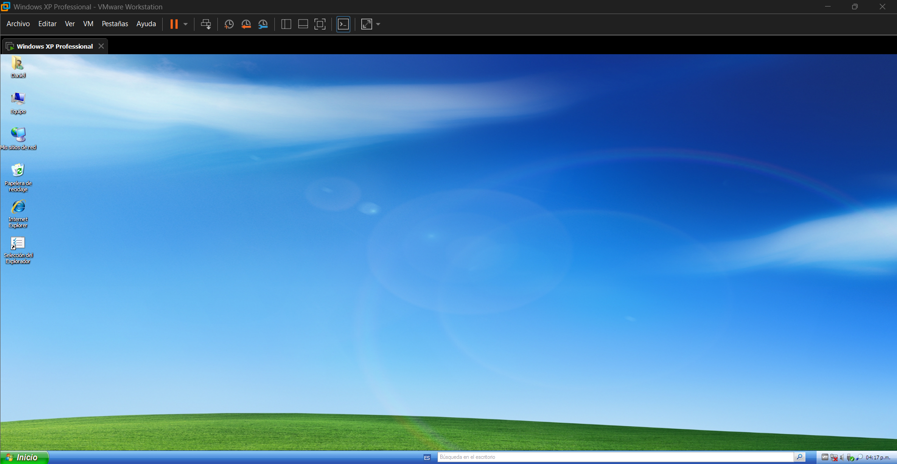
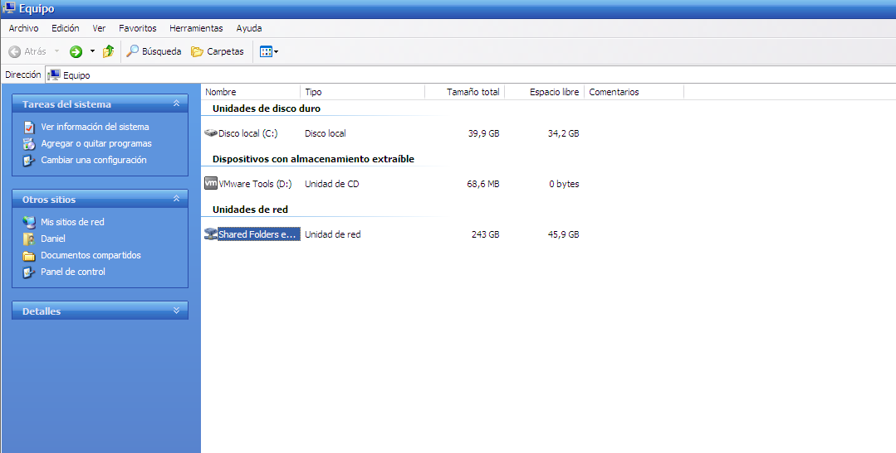
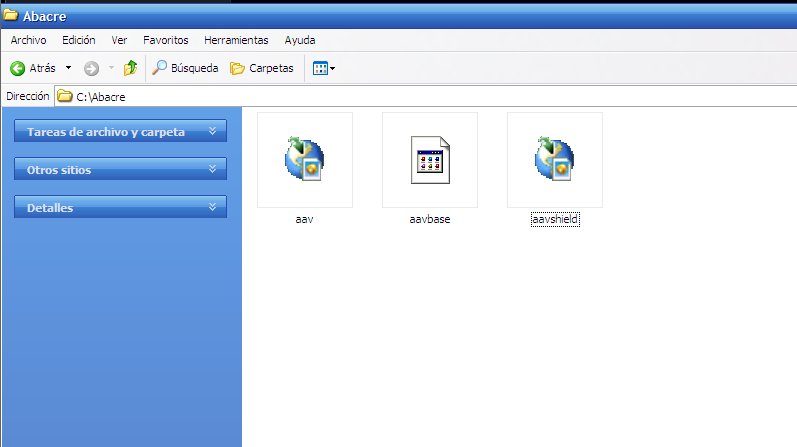
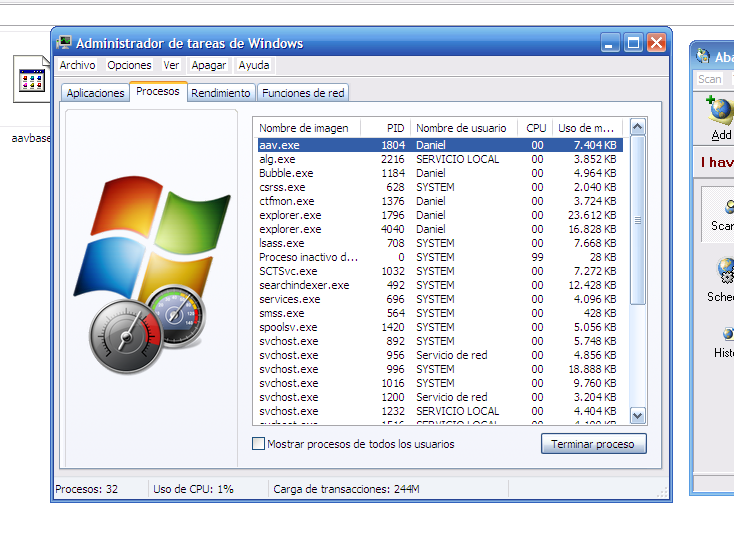
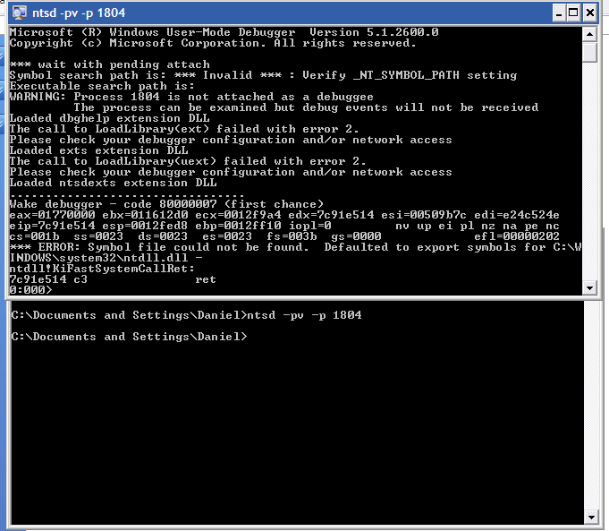
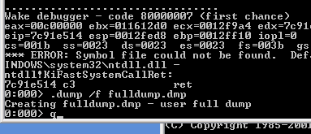
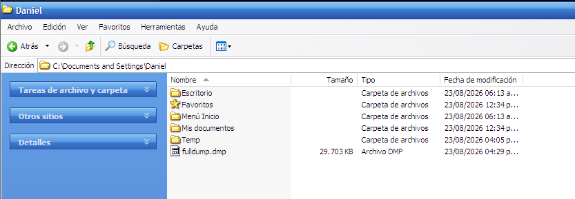

# Abacre Antivirus 1.3 — Ingeniería Inversa Académica

> **Fines exclusivamente académicos.** Análisis de un antivirus de 2006 con 0% de detección en evaluaciones independientes (113.334 muestras y test de 58 productos).

[](#-paso-a-paso-interactivo) [](#2-vm) [](#4-hallazgo)

## 📖 Paso a paso interactivo

### 1. Instalador
Se identifica `original/setup.exe` como **Inno Setup 5.1.2** (`SHA256 7EB44CC2...`).

```powershell
tools\innoextract.exe --info original\setup.exe
tools\innoextract.exe --list original\setup.exe  # 8 archivos: aav.exe, aavbase.dat...
tools\innoextract.exe --extract --output-dir extracted original\setup.exe
```
> Ver `analysis/hashes.sha256` y `Screenshots/1.png`

### 2. VM 
Se utiliza **VMWare Workstation Pro 26H1** con **XP Professional SP3 sin internet** (VirtualBox/Hyper-V descartados). La carpeta se comparte vía VMWare Tools y el contenido se copia a `C:\Abacre\`.

  

Guía completa en [`docs/04_guia_vm_completa.md`](docs/04_guia_vm_completa.md) y proceso fotográfico en [`docs/proceso_vm/README.md`](docs/proceso_vm/README.md)

### 3. Triage PE
`aav.exe` (559 KB) presenta 11 secciones vacías, entropía 7.99 e imports mínimos `LoadLibraryA/GetProcAddress` — indicador de packing. Recursos Delphi cifrados.

```powershell
python scripts\01_analyze_aavbase.py
python scripts\03_statistical_crypto.py  # entropía aavbase.dat 7.9876
```
> `docs/01_metodologia.md` | `analysis/aavbase/statistical.txt`

### 4. Hallazgo: Blowfish + 70 firmas
El dump de memoria (`ntsd -pv` → `aav_fulldump.dmp` 29 MB) revela `Cipher_Blowfish @0x21F3CF`, key `dkmoaio"jof"...` y 70 firmas reales:

`W32.Netsky.Z@mm, W32.Gaobot.YC/WO, W32.Beagle.W, W32.Sasser.B...` → `analysis/aavbase/signatures.txt`

   

Explicación del 0%: DB de 2003-2005 frente a malware de 2006+.

> Análisis detallado en [`docs/02_aavbase_analisis.md`](docs/02_aavbase_analisis.md)

### 5. Dump en VM (comandos exactos)
En XP, con `aav.exe` corriendo (PID en Administrador de tareas):
```cmd
ntsd -pv -p <PID>
.dump aav.dmp          # mini 11KB
.dump /f aav_fulldump.dmp  # full 29MB (usar /f, /ma da error 123)
q
```
Los archivos quedan en `C:\Documents and Settings\Usuario\` y se copian a `analysis/aavbase/`.

## 🗂 Estructura
```
original/  setup.exe + hashes
extracted/app/  aav.exe, aavshield.exe, aavbase.dat
Screenshots/ 1.png-10.png (proceso VM)
analysis/aavbase/ aav_fulldump.dmp, signatures.txt
scripts/ 01-06 reproducibles
tools/ innoextract, x64dbg, OllyDbg, vc_redist
docs/ guías en 3ª persona
```

## 🔗 Links rápidos
- Metodología: [`docs/01_metodologia.md`](docs/01_metodologia.md)
- Guía VM simple: [`docs/04_guia_vm_completa.md`](docs/04_guia_vm_completa.md)
- Signatures: [`analysis/aavbase/signatures.txt`](analysis/aavbase/signatures.txt)

## 📸 ¿Más capturas?
Sí — se agradecen capturas adicionales (x64dbg, Olly, PE-bear, IDR) para `Screenshots/`. Pueden añadirse a `Screenshots/` y referenciarse aquí. La carpeta aparte puede copiarse directamente a `Screenshots/`.

---
*Repositorio: `NoxiousCape/Abacre_Investigation` — Commit `5672a1b`*
