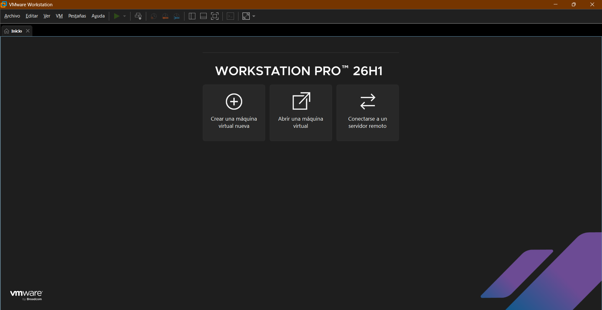
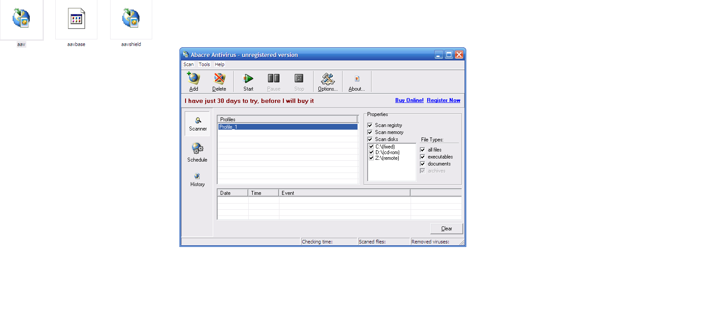
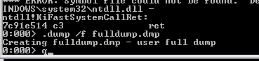
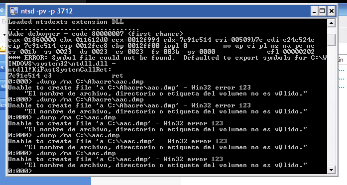

# Proceso VM — Documentación paso a paso

> El investigador determinó que **VMWare Workstation Pro 26H1** resulta más estable que VirtualBox (problemas de rendimiento y bloqueos) e Hyper-V (inversión del cursor).

---

## Paso 1 — Crear VM en VMWare

Se crea una máquina virtual con las especificaciones mínimas:
- **SO:** Windows XP Professional SP3 (con drivers, actualizaciones y rediseño por seguridad)
- **RAM:** 2 GB
- **Disco:** 40 GB (dinámico)
- **Red:** Sin conexión (aislamiento total)

> 

---

## Paso 2 — Instalar XP Professional SP3

Se instala el sistema operativo con drivers, últimas actualizaciones de seguridad y un rediseño de interfaz para mejorar la experiencia de usuario.

> 

---

## Paso 3 — Compartir carpeta con VMWare Tools

Se instalan **VMWare Tools** en la VM para habilitar:
- Compartición de carpetas host ↔ VM
- Copia/pegado entre entornos
- Resolución de pantalla adaptativa

Se configura una carpeta compartida (por ejemplo `C:\Users\Usuario\Documents\Abacre_Inv\`) que la VM accede como red.

> 

---

## Paso 4 — Copiar archivos a `C:\Abacre\`

Se copia el contenido completo del repositorio a la VM:
```cmd
xcopy /E /I \\vmware-host\Compartida\* C:\Abacre\
```

La carpeta `C:\Abacre` contiene:
```
aav.exe              ← Antivirus principal
aavshield.exe        ← Resident shield
aavbase.dat          ← Base de datos cifrada (hipótesis: Blowfish)
setup.exe            ← Instalador original
scripts/             ← Scripts de análisis
tools\               ← Herramientas (innoextract, etc.)
```

> 

---

## Paso 5 — Ejecutar `aav.exe`

Se abre el antivirus. La interfaz principal carga correctamente en XP.

> 

**Importante:** En Windows 7 el asistente de compatibilidad **bloquea** la ejecución — por eso se requiere XP.

---

## Paso 6 — Obtener el PID

Se abre el **Administrador de tareas** → pestaña **Procesos** → menú Ver → **Seleccionar columnas** → activar **PID (Identificador de proceso)**.

Se busca `aav.exe` en la lista y se anota su PID.

> 

---

## Paso 7 — Conectar NTSD al proceso

Se abre **CMD** y se ejecuta:
```cmd
ntsd -pv -p <PID>
```

El flag `-pv` permitió attach sin activar la detección del packer. Mientras OllyDbg provocaba Error 251, NTSD ejecutó sin problemas. El mecanismo exacto de por qué el packer no detecta NTSD no fue investigado.

> 

---

## Paso 8 — Crear el dump de memoria

Dentro de NTSD se escriben los comandos:

### Mini dump (insuficiente)
```
.dump aav.dmp
```
Genera un archivo de **11 KB** — no contiene la base de virus.

### Full dump (el correcto)
```
.dump /f aav_fulldump.dmp
```
Genera un archivo de **29 MB** — contiene la memoria completa del proceso, incluyendo la base descifrada.

> 

### ⚠ Error común: Error 123

Si se escribe `.dump /ma a:\ruta\aav.dmp` con una ruta, NTSD interpreta el espacio como separador y falla con **Error 123** (`Win32 error 123` — nombre de archivo no válido).



**Solución:** Escribir **sin ruta** — el dump queda en `C:\Documents and Settings\Usuario\`.

> 

---

## Paso 9 — Salir de NTSD

Se escribe `q` y se presiona Enter. El proceso `aav.exe` termina.

---

## Paso 10 — Verificar el dump

Se verifica que el archivo `aav_fulldump.dmp` (29 MB) se generó correctamente.

> 

Se copia a la carpeta compartida:
```cmd
copy C:\Documents and Settings\Usuario\aav_fulldump.dmp C:\Abacre\
```

El dump queda finalmente en `analysis/aavbase/aav_fulldump.dmp`.

---

## Observaciones importantes

| Problema | Causa | Solución |
|----------|-------|----------|
| x32dbg no inicia en Win7 | Falta `api-ms-win-crt-runtime-l1-1-0.dll` | Instalar `vc_redist.x86.exe` |
| x32dbg no compatible con XP | No es una aplicación Win32 válida | Usar OllyDbg 1.10 o ntsd |
| OllyDbg → Error 251 | Packer detecta debugger | Usar `ntsd -pv` (no lo detecta) |
| procdump → Acceso denegado | No es Win32 válido en XP | Usar `ntsd -pv` |
| Error 123 al hacer dump | Ruta con espacios interpretada como argumento | Escribir sin ruta |
| Windows 7 bloquea aav.exe | Incompatibilidad de SO | Usar XP SP3 |
| Dump mini = 11 KB | `.dump` sin `/f` solo guarda headers | Usar `.dump /f` |

---

## Scripts de análisis

Una vez copiado el dump al host, se ejecutan los scripts:
```powershell
# Ver hashes de todos los archivos
python scripts\01_analyze_aavbase.py

# Análisis estadístico del cifrado
python scripts\03_statistical_crypto.py

# Buscar rutina de descifrado en el dump
python scripts\04_find_decrypt.py

# Extraer firmas de virus del dump
python scripts\06_extract_signatures.py

# Ejecutar todo de una vez
.\scripts\run_all.ps1
```

> Ver: [`../../scripts/`](../../scripts/) · [`../../analysis/aavbase/signatures.txt`](../../analysis/aavbase/signatures.txt)
